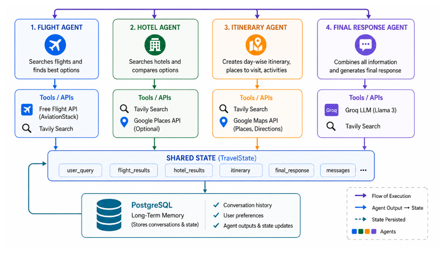
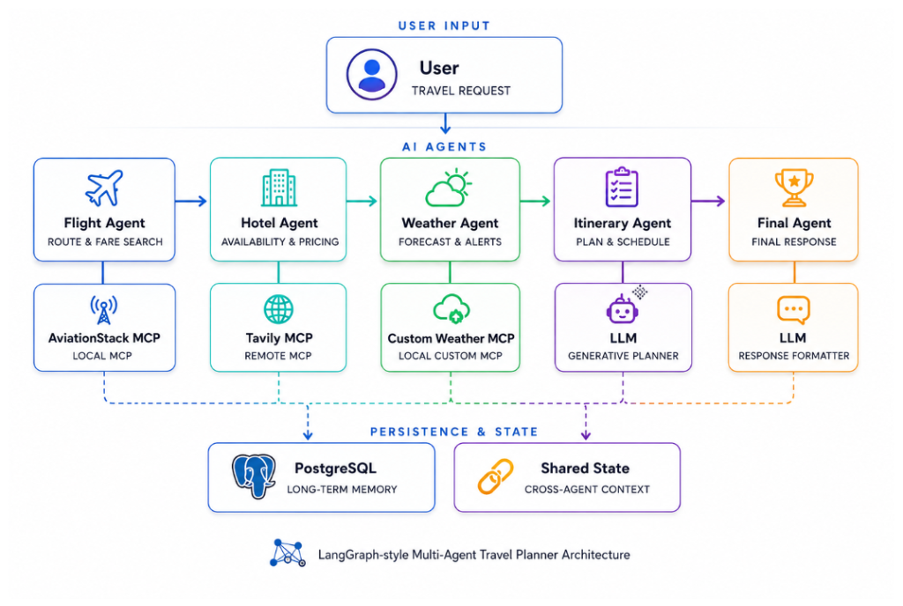
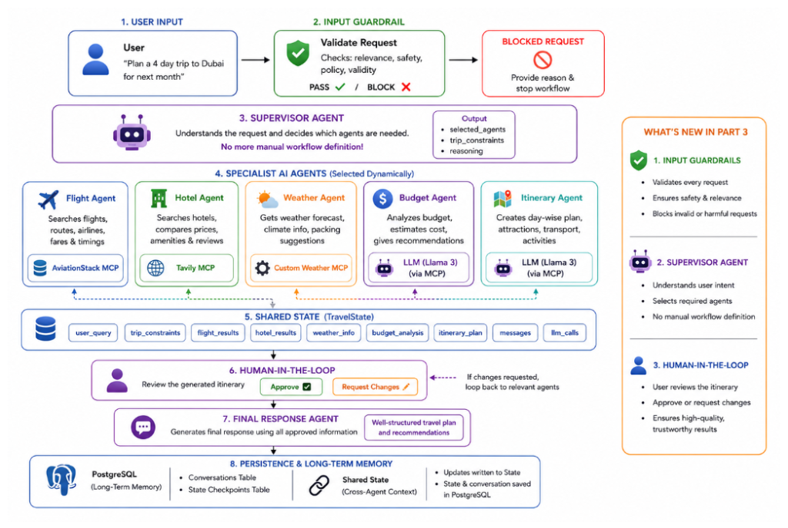

# ✈️ TripStrata-AI: Multi-Agent Travel Planner

> A production-ready multi-agent travel planning system built in **3 progressive parts**, evolving from a basic LangGraph pipeline to a fully supervised, guardrailed, human-reviewed AI assistant.

---

## 📑 Table of Contents

- [Project Evolution](#-project-evolution)
  - [Part 1 — Multi-Agent Foundation](#part-1--multi-agent-foundation-langgraph--postgresql)
  - [Part 2 — MCP Tool Integration](#part-2--mcp-tool-integration)
  - [Part 3 — Supervisor, Guardrails & HITL](#part-3--supervisor-guardrails--human-in-the-loop)
- [Architecture Overview](#-final-architecture-part-3)
- [Tech Stack](#-tech-stack)
- [Project Structure](#-project-structure)
- [Getting Started](#-getting-started)
- [API Endpoints](#-api-endpoints)
- [Configuration](#%EF%B8%8F-configuration--environment)
- [Contributing](#-contributing)
- [License](#-license)

---

## 🚀 Project Evolution

### Part 1 — Multi-Agent Foundation (LangGraph + PostgreSQL)

The foundation: a **4-agent pipeline** coordinated through LangGraph with shared state persisted in PostgreSQL.



**What was built:**

| Agent | Responsibility | Tools / APIs |
|-------|---------------|-------------|
| **Flight Agent** | Searches flights and finds best options | Free Flight API (AviationStack), Tavily Search |
| **Hotel Agent** | Searches hotels and compares options | Tavily Search, Google Places API (Optional) |
| **Itinerary Agent** | Creates day-wise itinerary, places to visit, activities | Tavily Search, Google Maps API |
| **Final Response Agent** | Combines all information and generates final response | Groq LLM, Tavily Search |

**Key concepts introduced:**
- ✅ LangGraph `StateGraph` for multi-agent orchestration
- ✅ Shared `TravelState` (TypedDict) passed between agents
- ✅ PostgreSQL long-term memory for conversation history, user preferences, and state persistence
- ✅ Sequential agent execution pipeline

---

### Part 2 — MCP Tool Integration

Upgraded agent tools from direct API calls to **Model Context Protocol (MCP)** servers — standardizing how agents access external data.



**What changed:**

| Agent | MCP Server | Type |
|-------|-----------|------|
| **Flight Agent** | AviationStack MCP | Local MCP (stdio) |
| **Hotel Agent** | Tavily MCP | Remote MCP (streamable HTTP) |
| **Weather Agent** *(new)* | Custom Weather MCP | Local Custom MCP (stdio) |
| **Itinerary Agent** | LLM (Generative Planner) | — |
| **Final Agent** | LLM (Response Formatter) | — |

**Key concepts introduced:**
- ✅ **MCP (Model Context Protocol)** for standardized tool access
- ✅ **Custom Weather MCP Server** (`custom_weather_mcp_server.py`) using OpenWeather API
- ✅ **AviationStack MCP** via `uvx` for flight data (airports, airlines)
- ✅ **Tavily MCP** via remote streamable HTTP for hotel search
- ✅ **Weather Agent** added — fetches current weather + 5-slot forecast
- ✅ Per-server isolation: one broken MCP server doesn't crash others

---

### Part 3 — Supervisor, Guardrails & Human-in-the-Loop

The final evolution: **intelligent orchestration**, **safety guardrails**, a new **Budget Agent**, and **human approval** before finalizing plans.



**What's new in Part 3:**

| Feature | Description |
|---------|------------|
| **Input Guardrails** | Validates every request for relevance and safety; blocks non-travel or harmful queries |
| **Supervisor Agent** | Understands user intent, dynamically selects which specialist agents are needed — no manual workflow definition |
| **Budget Agent** *(new)* | Analyzes trip cost feasibility, identifies budget risks, and suggests money-saving tips |
| **Human-in-the-Loop** | User reviews the generated itinerary draft; can approve ✅ or request changes ✏️ |
| **Dynamic Routing** | Supervisor conditionally routes to only the relevant agents instead of running all |

**Full agent pipeline (Part 3):**

```
User Input
  → Input Guardrail (PASS / BLOCK)
    → Supervisor Agent (selects agents dynamically)
      → Flight Agent → Hotel Agent → Weather Agent → Budget Agent → Itinerary Agent
        → Human-in-the-Loop (Approve / Revise)
          → Final Response Agent
            → PostgreSQL (persist state & conversation)
```

---

## 🏗 Final Architecture (Part 3)

The system runs **7 specialized nodes** in a LangGraph `StateGraph`:

| Node | Role | Data Source |
|------|------|------------|
| `supervisor` | Guardrail + agent selection | Groq LLM |
| `flight_agent` | Flight routes, airports, airlines, airfare | AviationStack MCP |
| `hotel_agent` | Hotel search and accommodation options | Tavily MCP |
| `weather_agent` | Current weather + forecast | Custom Weather MCP (OpenWeather) |
| `budget_agent` | Budget feasibility analysis | Groq LLM |
| `itinerary_agent` | Day-by-day travel plan draft | Groq LLM |
| `human_approval` | Pause for user review (LangGraph `interrupt`) | Human input |
| `final_agent` | Polished final response incorporating feedback | Groq LLM |

---

## 🛠 Tech Stack

| Layer | Technology |
|-------|-----------|
| **LLM** | Groq (openai/gpt-oss-20b — free tier) |
| **Agent Framework** | LangGraph (StateGraph, conditional edges, interrupt) |
| **Tool Protocol** | MCP (Model Context Protocol) via `langchain-mcp-adapters` |
| **MCP Servers** | AviationStack (stdio), Tavily (remote HTTP), Custom Weather (stdio) |
| **Backend** | FastAPI + Uvicorn |
| **Database** | PostgreSQL (LangGraph checkpointer for state persistence) |
| **Frontend** | HTML + CSS + Vanilla JavaScript |
| **Async Bridge** | `nest_asyncio` (sync agent functions calling async MCP helpers) |

---

## 📁 Project Structure

```
TripStrata-AI/
├── app.py                         # FastAPI web server & API endpoints
├── backend.py                     # Agent orchestration, supervisor, guardrails, HITL
├── mcp_client.py                  # MCP client helpers (Tavily, AviationStack, Weather)
├── custom_weather_mcp_server.py   # Custom MCP server for OpenWeather API
├── requirements.txt               # Python dependencies
├── .env.example                   # Environment variable template
├── Dockerfile                     # Docker support
├── assets/
│   ├── part1_architecture.png     # Part 1 architecture diagram
│   ├── part2_architecture.png     # Part 2 architecture diagram
│   └── part3_architecture.png     # Part 3 architecture diagram
├── templates/
│   └── index.html                 # Frontend HTML template
└── static/
    ├── style.css                  # Frontend styles
    └── script.js                  # Frontend JavaScript
```

---

## ⚡ Getting Started

### Prerequisites

- Python 3.10+
- Git
- [uv](https://docs.astral.sh/uv/) (for `uvx` — required by AviationStack MCP)
- PostgreSQL database (e.g., [Neon](https://neon.tech/) or [Render](https://render.com/) free tier)

### 1. Clone & set up environment

```powershell
git clone https://github.com/your-username/TripStrata-AI.git
cd TripStrata-AI

python -m venv .venv
.venv\Scripts\Activate.ps1    # PowerShell
```

### 2. Install dependencies

```powershell
pip install -r requirements.txt
```

### 3. Configure environment variables

Copy `.env.example` to `.env` and fill in your API keys:

```powershell
cp .env.example .env
```

Required keys:

| Variable | Source |
|----------|--------|
| `DATABASE_URL` | PostgreSQL connection string |
| `GROQ_API_KEY` | [Groq Console](https://console.groq.com/) |
| `GROQ_MODEL` | `openai/gpt-oss-20b` (free tier) |
| `AVIATIONSTACK_API_KEY` | [AviationStack](https://aviationstack.com/) |
| `TAVILY_API_KEY` | [Tavily](https://tavily.com/) |
| `OPENWEATHER_API_KEY` | [OpenWeather](https://openweathermap.org/api) |

### 4. Run the application

```powershell
python app.py
```

### 5. Open the web UI

Visit **http://127.0.0.1:8000** in your browser.

---

## 📡 API Endpoints

| Method | Endpoint | Description |
|--------|----------|-------------|
| `GET` | `/` | Web UI (HTML frontend) |
| `POST` | `/api/travel` | Start a travel planning thread |
| `POST` | `/api/travel/approve` | Approve or revise a draft itinerary |
| `GET` | `/health` | Health check & feature list |

### `POST /api/travel`

```json
{
  "message": "Plan a 4 day trip to Dubai for next month",
  "thread_id": null
}
```

### `POST /api/travel/approve`

```json
{
  "thread_id": "user_abc123",
  "approved": true,
  "feedback": ""
}
```

---

## ⚙️ Configuration & Environment

- Secrets and API keys are stored in a `.env` file (never committed to git)
- See [`.env.example`](.env.example) for the full template
- Optional: LangSmith tracing can be enabled via `LANGCHAIN_TRACING_V2=true`

---

## 🔧 Development Notes

- The project uses `nest_asyncio` in `app.py` to bridge synchronous agent functions with async MCP helpers inside FastAPI
- Each MCP server is isolated — a failed weather server won't break flight or hotel lookups
- PostgreSQL checkpointer enables resumable conversations across server restarts
- The supervisor gracefully falls back to the full agent pipeline if JSON parsing fails

---

## 🤝 Contributing

Contributions are welcome! Please open issues or pull requests for:
- Bug fixes
- Documentation improvements
- New MCP adapter examples
- UI enhancements

---

## 📄 License

This repository follows the license in the [`LICENSE`](LICENSE) file.

---

## 🙏 Acknowledgements

Built as a demonstration of modern AI agent patterns:
- **LangGraph** for multi-agent state orchestration
- **MCP** (Model Context Protocol) for standardized tool access
- **Groq** for fast, free-tier LLM inference
- **FastAPI** for the web backend

---

## 📬 Contact

For questions or suggestions, open an issue or contact the repository owner.
